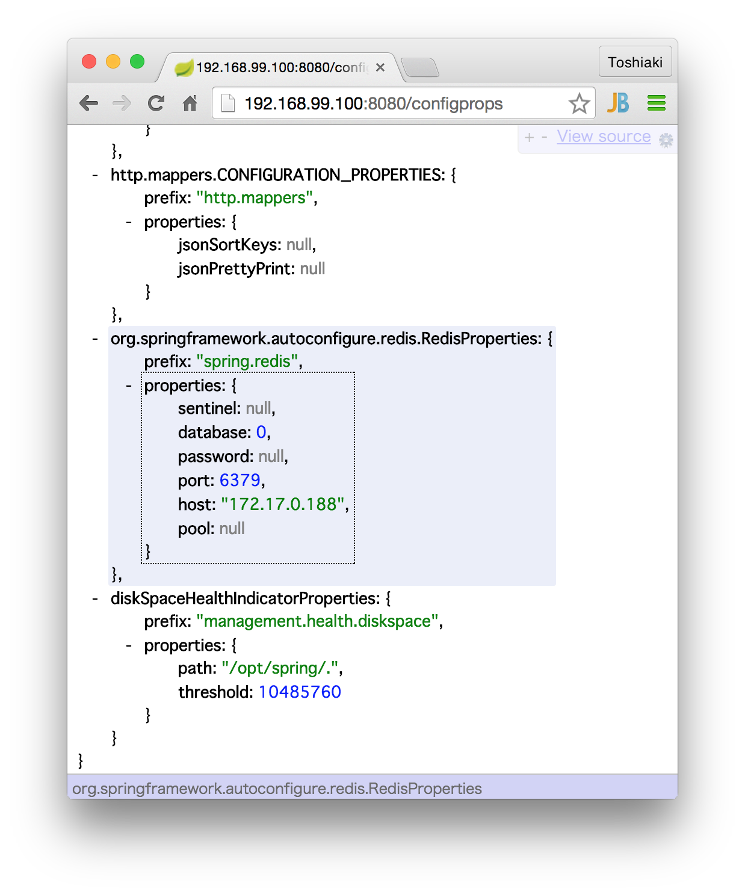
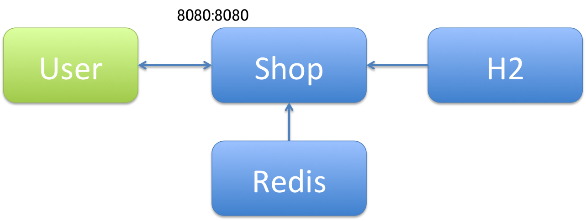
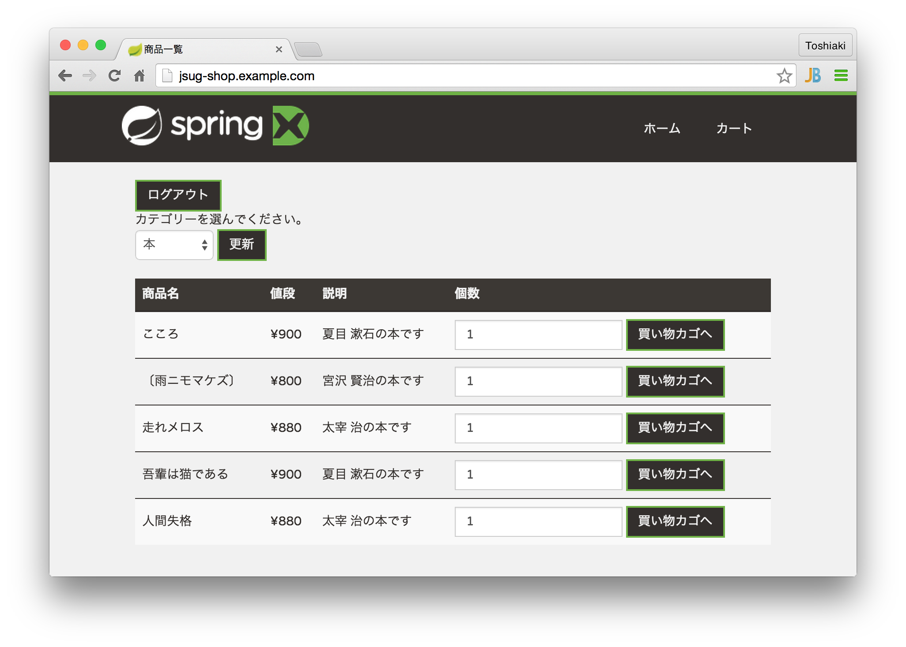
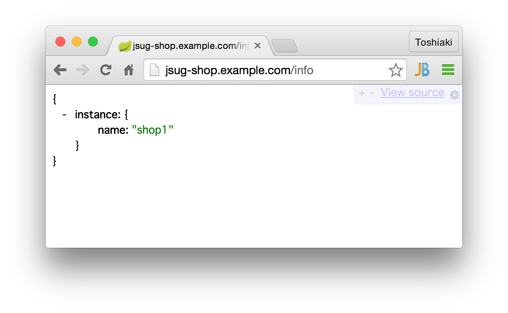
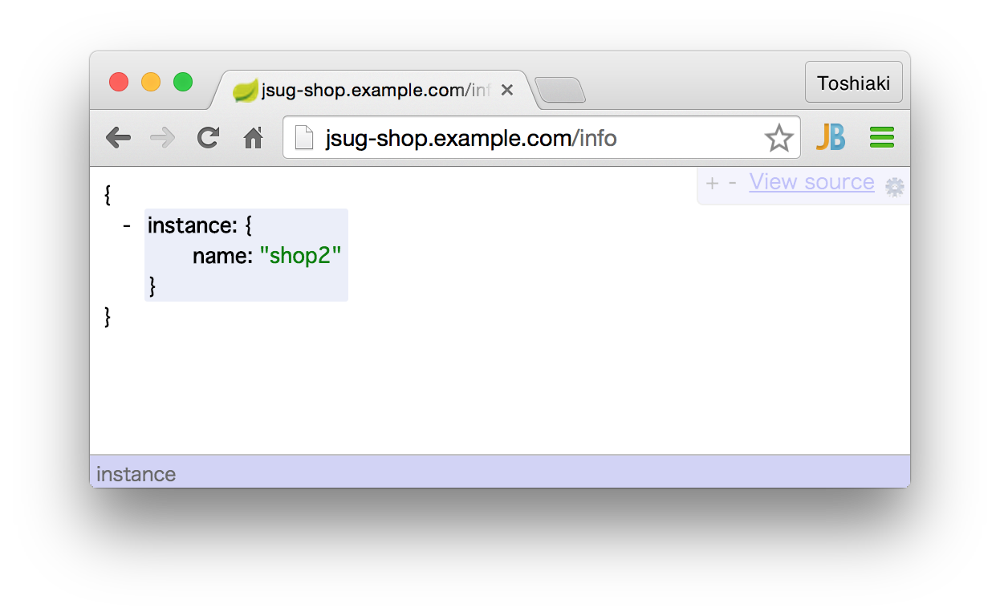
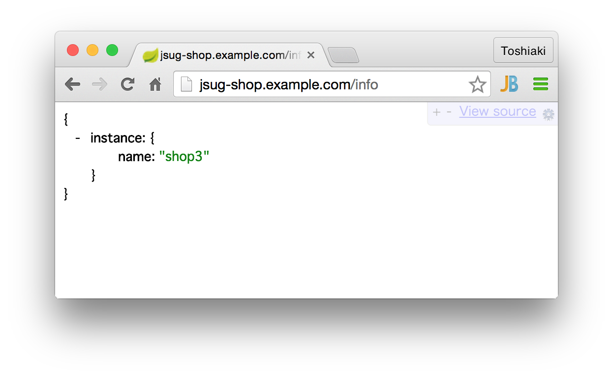

Dockerを使ってポータブルなシステムを構築
********************************************************************************

.. note::

    本ハンズオンではDockerに関する基本的な説明は行いません。

本章ではDockerを使って今回のハンズオンのシステムを構築し、システムをポータブルにしていきます。

まずは、以下の簡単なシステムをDockerを使って構築します。

.. figure:: ./images/docker01.png
   :width: 60%


.. note::

    Macの場合のDocker環境セットアップ方法を記載します(要Homebrew)。ここではDocker Machineというツールを使います。

    .. code-block:: console

        $ brew install docker boot2docker docker-machine Caskroom/cask/virtualbox
        $ docker-machine create -d virtualbox foo # Docker Machineを使って、VirtualBox上に、"foo"という名前のDockerホスト環境を作成
        $ eval "$(docker-machine env foo)" # 作成したDockerホスト環境にdockerコマンドでアクセスできるように環境変数を設定

    DockerでいうHello Worldを試しましょう。

    .. code-block:: console

        $ docker run --rm busybox echo "Hello World!"
        Hello World!

    DockerホストのIPアドレスは以下のコマンドで知ることができます。

    .. code-block:: console

        $ docker-machine ip foo
        192.168.99.100

Dockerイメージの作成と実行
================================================================================


アプリケーション(shop)のDockerイメージを作成しましょう。プロジェクト直下の\ ``Dockerfile``\ を作成し、以下の内容を記述してください。

.. code-block:: bash

    FROM java:8

    ADD target/jsug-shop-1.0-SNAPSHOT.jar /opt/spring/jsug-shop.jar
    EXPOSE 8080
    WORKDIR /opt/spring/
    ENTRYPOINT ["java", "-Djava.security.egd=file:/dev/./urandom", "-jar", "jsug-shop.jar"]

この\ ``Dockerfile``\ はDockerイメージにSpring Bootの実行可能jarを追加し、それを実行する形式になっています。Dockerイメージをビルドする前に
実行可能jarを作成してください。

.. code-block:: console

    $ mvn clean package

Dockerイメージをビルドしましょう。

.. code-block:: console

    $ docker build -t username/jsug-shop .
    Sending build context to Docker daemon 28.62 MB
    Sending build context to Docker daemon
    Step 0 : FROM java:8
     ---> 308e519aac60
    Step 1 : ADD target/jsug-shop-1.0-SNAPSHOT.jar /opt/spring/jsug-shop.jar
     ---> c179461538e7
    Removing intermediate container 2952f822a14d
    Step 2 : EXPOSE 8080
     ---> Running in 2d4b84e3030a
     ---> 5d8e08977225
    Removing intermediate container 2d4b84e3030a
    Step 3 : WORKDIR /opt/spring/
     ---> Running in 38557e543b55
     ---> 2fc472e05125
    Removing intermediate container 38557e543b55
    Step 4 : ENTRYPOINT java -Djava.security.egd=file:/dev/./urandom -jar jsug-shop.jar
     ---> Running in f10875067099
     ---> 0b1408650d2f
    Removing intermediate container f10875067099
    Successfully built 0b1408650d2f

DockerHubのアカウントを持っている場合は\ ``username``\ の部分には自分のユーザー名を使用してください。

作成したイメージを実行しましょう。

.. code-block:: console

    $ docker run -ti --rm -p 8080:8080 username/jsug-shop
    2015-06-13 08:40:46.089  INFO 1 --- [           main] jsug.App                                 : Starting App v1.0-SNAPSHOT on 686975d5de64 with PID 1 (/opt/spring/jsug-shop.jar started by root in /opt/spring)
    2015-06-13 08:40:46.193  INFO 1 --- [           main] ationConfigEmbeddedWebApplicationContext : Refreshing org.springframework.boot.context.embedded.AnnotationConfigEmbeddedWebApplicationContext@11fcb8a9: startup date [Sat Jun 13 08:40:46 UTC 2015]; root of context hierarchy
    2015-06-13 08:40:49.471  INFO 1 --- [           main] trationDelegate$BeanPostProcessorChecker : Bean 'org.springframework.scheduling.annotation.SchedulingConfiguration' of type [class org.springframework.scheduling.annotation.SchedulingConfiguration$$EnhancerBySpringCGLIB$$f5181086] is not eligible for getting processed by all BeanPostProcessors (for example: not eligible for auto-proxying)
    2015-06-13 08:40:49.938  INFO 1 --- [           main] trationDelegate$BeanPostProcessorChecker : Bean 'org.springframework.transaction.annotation.ProxyTransactionManagementConfiguration' of type [class org.springframework.transaction.annotation.ProxyTransactionManagementConfiguration$$EnhancerBySpringCGLIB$$84c28d6b] is not eligible for getting processed by all BeanPostProcessors (for example: not eligible for auto-proxying)
    2015-06-13 08:40:50.238  INFO 1 --- [           main] trationDelegate$BeanPostProcessorChecker : Bean 'transactionAttributeSource' of type [class org.springframework.transaction.annotation.AnnotationTransactionAttributeSource] is not eligible for getting processed by all BeanPostProcessors (for example: not eligible for auto-proxying)
    2015-06-13 08:40:50.272  INFO 1 --- [           main] trationDelegate$BeanPostProcessorChecker : Bean 'transactionInterceptor' of type [class org.springframework.transaction.interceptor.TransactionInterceptor] is not eligible for getting processed by all BeanPostProcessors (for example: not eligible for auto-proxying)
    2015-06-13 08:40:50.295  INFO 1 --- [           main] trationDelegate$BeanPostProcessorChecker : Bean 'org.springframework.transaction.config.internalTransactionAdvisor' of type [class org.springframework.transaction.interceptor.BeanFactoryTransactionAttributeSourceAdvisor] is not eligible for getting processed by all BeanPostProcessors (for example: not eligible for auto-proxying)
    2015-06-13 08:40:50.342  INFO 1 --- [           main] trationDelegate$BeanPostProcessorChecker : Bean 'org.springframework.cache.annotation.ProxyCachingConfiguration' of type [class org.springframework.cache.annotation.ProxyCachingConfiguration$$EnhancerBySpringCGLIB$$ec2057c9] is not eligible for getting processed by all BeanPostProcessors (for example: not eligible for auto-proxying)
    2015-06-13 08:40:50.383  INFO 1 --- [           main] trationDelegate$BeanPostProcessorChecker : Bean 'cacheOperationSource' of type [class org.springframework.cache.annotation.AnnotationCacheOperationSource] is not eligible for getting processed by all BeanPostProcessors (for example: not eligible for auto-proxying)
    2015-06-13 08:40:50.440  INFO 1 --- [           main] trationDelegate$BeanPostProcessorChecker : Bean 'cacheInterceptor' of type [class org.springframework.cache.interceptor.CacheInterceptor] is not eligible for getting processed by all BeanPostProcessors (for example: not eligible for auto-proxying)
    2015-06-13 08:40:50.450  INFO 1 --- [           main] trationDelegate$BeanPostProcessorChecker : Bean 'org.springframework.cache.config.internalCacheAdvisor' of type [class org.springframework.cache.interceptor.BeanFactoryCacheOperationSourceAdvisor] is not eligible for getting processed by all BeanPostProcessors (for example: not eligible for auto-proxying)
    2015-06-13 08:40:51.567  INFO 1 --- [           main] s.b.c.e.t.TomcatEmbeddedServletContainer : Tomcat initialized with port(s): 8080 (http)
    2015-06-13 08:40:51.965  INFO 1 --- [           main] o.apache.catalina.core.StandardService   : Starting service Tomcat
    2015-06-13 08:40:51.967  INFO 1 --- [           main] org.apache.catalina.core.StandardEngine  : Starting Servlet Engine: Apache Tomcat/8.0.20
    2015-06-13 08:40:52.289  INFO 1 --- [ost-startStop-1] o.a.c.c.C.[Tomcat].[localhost].[/]       : Initializing Spring embedded WebApplicationContext
    (略)
    2015-06-13 08:40:57.760  WARN 1 --- [           main] ationConfigEmbeddedWebApplicationContext : Exception encountered during context initialization - cancelling refresh attempt

    org.springframework.beans.factory.BeanCreationException: Error creating bean with name 'enableRedisKeyspaceNotificationsInitializer' defined in class path resource [org/springframework/session/data/redis/config/annotation/web/http/RedisHttpSessionConfiguration.class]: Invocation of init method failed; nested exception is org.springframework.data.redis.RedisConnectionFailureException: Cannot get Jedis connection; nested exception is redis.clients.jedis.exceptions.JedisConnectionException: Could not get a resource from the pool
        at org.springframework.beans.factory.support.AbstractAutowireCapableBeanFactory.initializeBean(AbstractAutowireCapableBeanFactory.java:1574)
        at org.springframework.beans.factory.support.AbstractAutowireCapableBeanFactory.doCreateBean(AbstractAutowireCapableBeanFactory.java:539)
        at org.springframework.beans.factory.support.AbstractAutowireCapableBeanFactory.createBean(AbstractAutowireCapableBeanFactory.java:476)
        at org.springframework.beans.factory.support.AbstractBeanFactory$1.getObject(AbstractBeanFactory.java:303)
        at org.springframework.beans.factory.support.DefaultSingletonBeanRegistry.getSingleton(DefaultSingletonBeanRegistry.java:230)
        at org.springframework.beans.factory.support.AbstractBeanFactory.doGetBean(AbstractBeanFactory.java:299)
        at org.springframework.beans.factory.support.AbstractBeanFactory.getBean(AbstractBeanFactory.java:194)
        at org.springframework.beans.factory.support.DefaultListableBeanFactory.preInstantiateSingletons(DefaultListableBeanFactory.java:755)
        at org.springframework.context.support.AbstractApplicationContext.finishBeanFactoryInitialization(AbstractApplicationContext.java:757)
        at org.springframework.context.support.AbstractApplicationContext.refresh(AbstractApplicationContext.java:480)
        at org.springframework.boot.context.embedded.EmbeddedWebApplicationContext.refresh(EmbeddedWebApplicationContext.java:118)
        at org.springframework.boot.SpringApplication.refresh(SpringApplication.java:686)
        at org.springframework.boot.SpringApplication.run(SpringApplication.java:320)
        at org.springframework.boot.SpringApplication.run(SpringApplication.java:957)
        at org.springframework.boot.SpringApplication.run(SpringApplication.java:946)
        at jsug.App.main(App.java:9)
        at sun.reflect.NativeMethodAccessorImpl.invoke0(Native Method)
        at sun.reflect.NativeMethodAccessorImpl.invoke(NativeMethodAccessorImpl.java:62)
        at sun.reflect.DelegatingMethodAccessorImpl.invoke(DelegatingMethodAccessorImpl.java:43)
        at java.lang.reflect.Method.invoke(Method.java:497)
        at org.springframework.boot.loader.MainMethodRunner.run(MainMethodRunner.java:53)
        at java.lang.Thread.run(Thread.java:745)
    Caused by: org.springframework.data.redis.RedisConnectionFailureException: Cannot get Jedis connection; nested exception is redis.clients.jedis.exceptions.JedisConnectionException: Could not get a resource from the pool
        at org.springframework.data.redis.connection.jedis.JedisConnectionFactory.fetchJedisConnector(JedisConnectionFactory.java:140)
        at org.springframework.data.redis.connection.jedis.JedisConnectionFactory.getConnection(JedisConnectionFactory.java:229)
        at org.springframework.data.redis.connection.jedis.JedisConnectionFactory.getConnection(JedisConnectionFactory.java:57)
        at org.springframework.session.data.redis.config.annotation.web.http.RedisHttpSessionConfiguration$EnableRedisKeyspaceNotificationsInitializer.afterPropertiesSet(RedisHttpSessionConfiguration.java:168)
        at org.springframework.beans.factory.support.AbstractAutowireCapableBeanFactory.invokeInitMethods(AbstractAutowireCapableBeanFactory.java:1633)
        at org.springframework.beans.factory.support.AbstractAutowireCapableBeanFactory.initializeBean(AbstractAutowireCapableBeanFactory.java:1570)
        ... 21 common frames omitted
    Caused by: redis.clients.jedis.exceptions.JedisConnectionException: Could not get a resource from the pool
        at redis.clients.util.Pool.getResource(Pool.java:42)
        at redis.clients.jedis.JedisPool.getResource(JedisPool.java:84)
        at redis.clients.jedis.JedisPool.getResource(JedisPool.java:10)
        at org.springframework.data.redis.connection.jedis.JedisConnectionFactory.fetchJedisConnector(JedisConnectionFactory.java:133)
        ... 26 common frames omitted
    Caused by: redis.clients.jedis.exceptions.JedisConnectionException: java.net.ConnectException: Connection refused
        at redis.clients.jedis.Connection.connect(Connection.java:150)
        at redis.clients.jedis.BinaryClient.connect(BinaryClient.java:71)
        at redis.clients.jedis.BinaryJedis.connect(BinaryJedis.java:1783)
        at redis.clients.jedis.JedisFactory.makeObject(JedisFactory.java:65)
        at org.apache.commons.pool2.impl.GenericObjectPool.create(GenericObjectPool.java:836)
        at org.apache.commons.pool2.impl.GenericObjectPool.borrowObject(GenericObjectPool.java:434)
        at org.apache.commons.pool2.impl.GenericObjectPool.borrowObject(GenericObjectPool.java:361)
        at redis.clients.util.Pool.getResource(Pool.java:40)
        ... 29 common frames omitted
    Caused by: java.net.ConnectException: Connection refused
        at java.net.PlainSocketImpl.socketConnect(Native Method)
        at java.net.AbstractPlainSocketImpl.doConnect(AbstractPlainSocketImpl.java:345)
        at java.net.AbstractPlainSocketImpl.connectToAddress(AbstractPlainSocketImpl.java:206)
        at java.net.AbstractPlainSocketImpl.connect(AbstractPlainSocketImpl.java:188)
        at java.net.SocksSocketImpl.connect(SocksSocketImpl.java:392)
        at java.net.Socket.connect(Socket.java:589)
        at redis.clients.jedis.Connection.connect(Connection.java:144)
        ... 36 common frames omitted

    2015-06-13 08:40:57.775  INFO 1 --- [           main] o.apache.catalina.core.StandardService   : Stopping service Tomcat
    2015-06-13 08:40:57.914  WARN 1 --- [           main] o.s.boot.SpringApplication               : Error handling failed (Error creating bean with name 'delegatingApplicationListener' defined in class path resource [org/springframework/security/config/annotation/web/configuration/WebSecurityConfiguration.class]: BeanPostProcessor before instantiation of bean failed; nested exception is org.springframework.beans.factory.BeanCreationException: Error creating bean with name 'org.springframework.cache.annotation.ProxyCachingConfiguration': Initialization of bean failed; nested exception is org.springframework.beans.factory.NoSuchBeanDefinitionException: No bean named 'org.springframework.context.annotation.ConfigurationClassPostProcessor.importRegistry' is defined)
    2015-06-13 08:40:57.915 ERROR 1 --- [           main] o.s.boot.SpringApplication               : Application startup failed
    ...

Redisが見つからないなため、起動に失敗しました。RedisもDockerで起動しましょう。

Redis用のDockerコンテナは\ ``redis``\ という名前をつけてで、デーモン化(\ ``-d``\ )しておきます。

.. code-block:: console

    $ docker run -d --name redis -p 6379:6379 redis
    7ee17e37af0edf5152c67af74104bdeccba7f4d7fa89f960922b8eb2c6f99fd3
    $ docker ps
    CONTAINER ID        IMAGE               COMMAND                CREATED             STATUS              PORTS                    NAMES
    7ee17e37af0e        redis:latest        "/entrypoint.sh redi   6 seconds ago       Up 5 seconds        0.0.0.0:6379->6379/tcp   redis

shopイメージの\ ``Dockerfile``\ は\ ``ENTRYPOINT``\ でJavaを実行するようにしていたので、実行時に引数を追加することができます。\ ``--spring.redis.host=<DockerホストのIP>``\ をつけて実行しましょう。

.. code-block:: console

    $ docker run -ti --rm -p 8080:8080 username/jsug-shop --spring.redis.host=192.168.99.100
    2015-06-14 16:04:40.351  INFO 1 --- [           main] jsug.App                                 : Starting App v1.0-SNAPSHOT on 4669421a301e with PID 1 (/opt/spring/jsug-shop.jar started by root in /opt/spring)
    2015-06-14 16:04:40.447  INFO 1 --- [           main] ationConfigEmbeddedWebApplicationContext : Refreshing org.springframework.boot.context.embedded.AnnotationConfigEmbeddedWebApplicationContext@7f940864: startup date [Sun Jun 14 16:04:40 UTC 2015]; root of context hierarchy
    2015-06-14 16:04:43.317  INFO 1 --- [           main] trationDelegate$BeanPostProcessorChecker : Bean 'org.springframework.scheduling.annotation.SchedulingConfiguration' of type [class org.springframework.scheduling.annotation.SchedulingConfiguration$$EnhancerBySpringCGLIB$$bfffe999] is not eligible for getting processed by all BeanPostProcessors (for example: not eligible for auto-proxying)
    2015-06-14 16:04:43.863  INFO 1 --- [           main] trationDelegate$BeanPostProcessorChecker : Bean 'org.springframework.transaction.annotation.ProxyTransactionManagementConfiguration' of type [class org.springframework.transaction.annotation.ProxyTransactionManagementConfiguration$$EnhancerBySpringCGLIB$$4faa667e] is not eligible for getting processed by all BeanPostProcessors (for example: not eligible for auto-proxying)
    2015-06-14 16:04:44.119  INFO 1 --- [           main] trationDelegate$BeanPostProcessorChecker : Bean 'transactionAttributeSource' of type [class org.springframework.transaction.annotation.AnnotationTransactionAttributeSource] is not eligible for getting processed by all BeanPostProcessors (for example: not eligible for auto-proxying)
    2015-06-14 16:04:44.153  INFO 1 --- [           main] trationDelegate$BeanPostProcessorChecker : Bean 'transactionInterceptor' of type [class org.springframework.transaction.interceptor.TransactionInterceptor] is not eligible for getting processed by all BeanPostProcessors (for example: not eligible for auto-proxying)
    2015-06-14 16:04:44.174  INFO 1 --- [           main] trationDelegate$BeanPostProcessorChecker : Bean 'org.springframework.transaction.config.internalTransactionAdvisor' of type [class org.springframework.transaction.interceptor.BeanFactoryTransactionAttributeSourceAdvisor] is not eligible for getting processed by all BeanPostProcessors (for example: not eligible for auto-proxying)
    2015-06-14 16:04:44.204  INFO 1 --- [           main] trationDelegate$BeanPostProcessorChecker : Bean 'org.springframework.cache.annotation.ProxyCachingConfiguration' of type [class org.springframework.cache.annotation.ProxyCachingConfiguration$$EnhancerBySpringCGLIB$$b70830dc] is not eligible for getting processed by all BeanPostProcessors (for example: not eligible for auto-proxying)
    2015-06-14 16:04:44.233  INFO 1 --- [           main] trationDelegate$BeanPostProcessorChecker : Bean 'cacheOperationSource' of type [class org.springframework.cache.annotation.AnnotationCacheOperationSource] is not eligible for getting processed by all BeanPostProcessors (for example: not eligible for auto-proxying)
    2015-06-14 16:04:44.277  INFO 1 --- [           main] trationDelegate$BeanPostProcessorChecker : Bean 'cacheInterceptor' of type [class org.springframework.cache.interceptor.CacheInterceptor] is not eligible for getting processed by all BeanPostProcessors (for example: not eligible for auto-proxying)
    2015-06-14 16:04:44.284  INFO 1 --- [           main] trationDelegate$BeanPostProcessorChecker : Bean 'org.springframework.cache.config.internalCacheAdvisor' of type [class org.springframework.cache.interceptor.BeanFactoryCacheOperationSourceAdvisor] is not eligible for getting processed by all BeanPostProcessors (for example: not eligible for auto-proxying)
    2015-06-14 16:04:45.086  INFO 1 --- [           main] s.b.c.e.t.TomcatEmbeddedServletContainer : Tomcat initialized with port(s): 8080 (http)
    2015-06-14 16:04:45.504  INFO 1 --- [           main] o.apache.catalina.core.StandardService   : Starting service Tomcat
    2015-06-14 16:04:45.506  INFO 1 --- [           main] org.apache.catalina.core.StandardEngine  : Starting Servlet Engine: Apache Tomcat/8.0.20
    2015-06-14 16:04:45.828  INFO 1 --- [ost-startStop-1] o.a.c.c.C.[Tomcat].[localhost].[/]       : Initializing Spring embedded WebApplicationContext
    2015-06-14 16:04:45.828  INFO 1 --- [ost-startStop-1] o.s.web.context.ContextLoader            : Root WebApplicationContext: initialization completed in 5385 ms
    (略)
    2015-06-14 16:04:54.156  INFO 1 --- [           main] s.b.c.e.t.TomcatEmbeddedServletContainer : Tomcat started on port(s): 8080 (http)
    2015-06-14 16:04:54.160  INFO 1 --- [           main] jsug.App                                 : Started App in 14.291 seconds (JVM running for 14.978)

無事、起動しました。

ただ、いちいちDockerで起動したRedisの情報を調べて、アプリケーションの外から指定するのは面倒ですね。

起動したアプリケーションのコンテナはCtrl+Cで終了できます。

Dockerのリンク機能使用
================================================================================

Dockerのリンク機能を使うと、他のコンテナで起動したプロセスのIPとポートが環境変数に設定されます。

IPは環境変数\ ``(コンテナ名)_PORT_(コンテナ内で起動したポート番号)_TCP_ADDR``\ に、ポートは数\ ``(コンテナ名)_PORT_(コンテナ内で起動したポート番号)_TCP_PORT``\ に設定されます。
例えば先のRedisの場合だと、それぞれ\ ``REDIS_PORT_6379_TCP_ADDR``\ と\ ``REDIS_PORT_6379_TCP_PORT``\ です。

Redisのコンテナとリンクさせて、Shopのコンテナを起動する場合は以下のようにします。

.. code-block:: console

    $ docker run -ti --rm --link redis:redis -p 8080:8080 username/jsug-shop --spring.redis.host=\${REDIS_PORT_6379_TCP_ADDR} --spring.redis.port=\${REDIS_PORT_6379_TCP_PORT}

Spring Boot Actuatorが有効になっているので\ ``http://<DockerホストのIP>:8080/configprops``\ にアクセス(要ログイン)すれば、プロパティに設定されている値を確認できます。



.. note::

    リンクを使った場合、Docker内部のネットワークを使用するので、Redisのポートは公開する必要はありません(\ ``-p 6379:6379``\ は不要です)。

    .. code-block:: console

        $ docker rm -f redis
        $ docker run -d --name redis redis
        $ docker run -ti --rm --link redis:redis -p 8080:8080 username/jsug-shop --spring.redis.host=\${REDIS_PORT_6379_TCP_ADDR} --spring.redis.port=\${REDIS_PORT_6379_TCP_PORT}

これ以降、Redisの設定には\ ``${REDIS_PORT_6379_TCP_ADDR}``\ と\ ``${REDIS_PORT_6379_TCP_PORT}``\ を使用するので、\ ``src/main/resource/application.properties``\ にあらかじめ設定しておきましょう。


.. code-block:: console
    :emphasize-lines: 3-4

    spring.thymeleaf.cache=false
    spring.main.show-banner=false
    spring.redis.port=${REDIS_PORT_6379_TCP_PORT:6379}
    spring.redis.host=${REDIS_PORT_6379_TCP_ADDR:localhost}
    security.basic.enabled=false
    logging.level.jdbc=OFF
    logging.level.jdbc.sqltiming=DEBUG

設定ファイルを修正した後は、サイドDockerイメージをビルドします。

.. code-block:: console

    $ mvn clean package
    $ docker build -t username/jsug-shop .

今度はH2のコンテナも起動して、リンクさせましょう。




.. code-block:: console

    $ docker run -d --name redis redis # まだ起動していない場合
    $ docker run -d --name h2 making/h2-server
    $ docker run -ti --rm --link redis:redis --link h2:h2 -p 8080:8080 username/jsug-shop --spring.datasource.url=jdbc:h2:tcp://\${H2_PORT_1521_TCP_ADDR}:\${H2_PORT_1521_TCP_PORT}/~/jsug-shop

今回はH2サーバーを使用しているので、アプリケーションのコンテナを落とした後、再度起動するとデータは続けて使用できます。

一度、RedisとH2のコンテナは削除しておきます。

.. code-block:: console

    $ docker rm -f redis h2

ここで作成した、Dockerイメージは本ハンズオンの最終版なので、DockerHubのアカウントを持っている場合は、この状態でDockerリポジトリにデプロイしましょう。

.. code-block:: console

    $ docker login
    $ docker push username/jsug-shop

一度、Dockerリポジトリに公開されれば、このアプリケーションイメージはどこからでもだれでも簡単に実行可能です。
例えば、私(making)がデプロイしたイメージを使いたいならば、以下のように実行してください。

.. code-block:: console

    $ docker run -ti --rm -p 8080:8080 making/jsug-shop

Spring Bootと組み合わせることで、さらなる高ポータビリティを実現できます。

Docker Composeでシステム構成を記述
================================================================================

ここまででDockerのコンテナを複数組み合わせてシステムを構築してきました。複数のコンテナを手動で起動し、関連するものどうしリンクさせていく作業は面倒です。
そこで、システムで使用するコンテナの情報およびコンテナ間の情報を記述してまとめて起動・停止など管理できるようにしたのがDocker Composeです。

.. note::

    Macの場合の場合は次のようにインストールしてください。

    .. code-block:: console

        $ brew install docker-compose

先ほど構築したシステムをDocker Composeで記述しましょう。\ ``docker-compose.yml``\ を作成して、以下の内容を記述してください。(\ ``username`` \ の部分は、自分の環境に合わせて書き換えてください)

.. code-block:: yaml

    redis:
      image: redis
    h2:
      image: making/h2-server
    shop:
      # build: .
      image: username/jsug-shop
      ports:
        - "8080:8080"
      links:
        - redis
        - h2
      command: >
        --spring.datasource.url=jdbc:h2:tcp://${H2_PORT_1521_TCP_ADDR}:${H2_PORT_1521_TCP_PORT}/~/jsug-shop

\ ``docker-compose``\ コマンドでこのシステムを実行しましょう。

.. code-block:: console

    $ docker-compose up
    Creating jsugshop_h2_1...
    Creating jsugshop_redis_1...
    Creating jsugshop_shop_1...
    Attaching to jsugshop_h2_1, jsugshop_redis_1, jsugshop_shop_1
    h2_1    | Web Console server running at http://172.17.0.203:8181 (others can connect)
    h2_1    | TCP server running at tcp://172.17.0.203:1521 (others can connect)
    redis_1 | 1:C 15 Jun 13:58:14.689 # Warning: no config file specified, using the default config. In order to specify a config file use redis-server /path/to/redis.conf
    redis_1 |                 _._
    redis_1 |            _.-``__ ''-._
    redis_1 |       _.-``    `.  `_.  ''-._           Redis 3.0.1 (00000000/0) 64 bit
    redis_1 |   .-`` .-```.  ```\/    _.,_ ''-._
    redis_1 |  (    '      ,       .-`  | `,    )     Running in standalone mode
    redis_1 |  |`-._`-...-` __...-.``-._|'` _.-'|     Port: 6379
    redis_1 |  |    `-._   `._    /     _.-'    |     PID: 1
    redis_1 |   `-._    `-._  `-./  _.-'    _.-'
    redis_1 |  |`-._`-._    `-.__.-'    _.-'_.-'|
    redis_1 |  |    `-._`-._        _.-'_.-'    |           http://redis.io
    redis_1 |   `-._    `-._`-.__.-'_.-'    _.-'
    redis_1 |  |`-._`-._    `-.__.-'    _.-'_.-'|
    redis_1 |  |    `-._`-._        _.-'_.-'    |
    redis_1 |   `-._    `-._`-.__.-'_.-'    _.-'
    redis_1 |       `-._    `-.__.-'    _.-'
    redis_1 |           `-._        _.-'
    redis_1 |               `-.__.-'
    redis_1 |
    redis_1 | 1:M 15 Jun 13:58:14.691 # Server started, Redis version 3.0.1
    redis_1 | 1:M 15 Jun 13:58:14.691 # WARNING overcommit_memory is set to 0! Background save may fail under low memory condition. To fix this issue add 'vm.overcommit_memory = 1' to /etc/sysctl.conf and then reboot or run the command 'sysctl vm.overcommit_memory=1' for this to take effect.
    redis_1 | 1:M 15 Jun 13:58:14.691 # WARNING you have Transparent Huge Pages (THP) support enabled in your kernel. This will create latency and memory usage issues with Redis. To fix this issue run the command 'echo never > /sys/kernel/mm/transparent_hugepage/enabled' as root, and add it to your /etc/rc.local in order to retain the setting after a reboot. Redis must be restarted after THP is disabled.
    redis_1 | 1:M 15 Jun 13:58:14.691 # WARNING: The TCP backlog setting of 511 cannot be enforced because /proc/sys/net/core/somaxconn is set to the lower value of 128.
    redis_1 | 1:M 15 Jun 13:58:14.691 * The server is now ready to accept connections on port 6379
    shop_1  | 2015-06-15 13:58:17.202  INFO 1 --- [           main] jsug.App                                 : Starting App v1.0-SNAPSHOT on 1ea7b28b9dd7 with PID 1 (/opt/spring/jsug-shop.jar started by root in /opt/spring)
    shop_1  | 2015-06-15 13:58:17.323  INFO 1 --- [           main] ationConfigEmbeddedWebApplicationContext : Refreshing org.springframework.boot.context.embedded.AnnotationConfigEmbeddedWebApplicationContext@11fcb8a9: startup date [Mon Jun 15 13:58:17 UTC 2015]; root of context hierarchy
    (略)
    shop_1  | 2015-06-15 13:58:41.342  INFO 1 --- [           main] s.b.c.e.t.TomcatEmbeddedServletContainer : Tomcat started on port(s): 8080 (http)
    shop_1  | 2015-06-15 13:58:41.347  INFO 1 --- [           main] jsug.App                                 : Started App in 24.747 seconds (JVM running for 25.838)

H2、Redis、Shopがそれぞれ起動したことがわかります。また、Ctrl+Cで終了できます。

.. note::

    運用時には不要なログを抑制したり、テンプレートのキャッシュを有効にしたいので、\ ``docker-compose.yml``\ には以下のように引数を設定しておくのが良いです。

    .. code-block:: yaml
        :emphasize-lines: 14-17

        redis:
          image: redis
        h2:
          image: making/h2-server
        shop:
          # build: .
          image: username/jsug-shop
          ports:
            - "8080:8080"
          links:
            - redis
            - h2
          command: >
            --spring.thymeleaf.cache=true
            --logging.level.jdbc.resultsettable=ERROR
            --logging.level.jdbc.sqltiming=ERROR
            --logging.level.org=WARN
            --spring.datasource.url=jdbc:h2:tcp://${H2_PORT_1521_TCP_ADDR}:${H2_PORT_1521_TCP_PORT}/~/jsug-shop

Docker Composeを使って、Dockerイメージを組み合わせることでアプリケーションだけでなく、
そのアプリケーションに必要なミドルウェアもまとめて起動できるため、システム自体をポータブルにできます。

ロードバランサを配置してアプリケーションをスケールアウト
================================================================================

最後に、フロントにロードバランサ(Nginx)を置いて、Shopアプリケーションをスケールアウトしましょう。

.. figure:: ./images/docker03.png
   :width: 80%

この構成は、すでに公開されているNginxのイメージ(\ `jwilder/nginx-proxy <https://github.com/jwilder/nginx-proxy>`_\ )を使うことで簡単に構築できます。

jwilder/nginx-proxyはリバースプロキシとして機能し、環境変数\ ``VIRTUAL_HOST``\ をもつコンテナに対し、そのホスト名へのリクエストをルーティングします。
\ ``VIRTUAL_HOST``\ の値が同じ場合はそのホストへのリクエストがロードバランスされます。

\ ``docker-compose.yml``\ を以下の内容に変更してください。(\ ``username``\ の部分は、自分の環境に合わせて書き換えてください)

.. code-block:: yaml

    lb:
      image: jwilder/nginx-proxy
      ports:
        - "80:80"
      volumes:
        - "/var/run/docker.sock:/tmp/docker.sock"
    redis:
      image: redis
    h2:
      image: making/h2-server
    shop1:
      image: username/jsug-shop
      links:
        - redis
        - h2
      environment:
        VIRTUAL_HOST: jsug-shop.example.com
      command: >
        --spring.thymeleaf.cache=true
        --logging.level.jdbc.resultsettable=ERROR
        --logging.level.jdbc.sqltiming=ERROR
        --logging.level.org=WARN
        --spring.datasource.url=jdbc:h2:tcp://${H2_PORT_1521_TCP_ADDR}:${H2_PORT_1521_TCP_PORT}/~/jsug-shop
        --info.instance.name=shop1
    shop2:
      image: username/jsug-shop
      links:
        - redis
        - h2
      environment:
        VIRTUAL_HOST: jsug-shop.example.com
      command: >
        --spring.thymeleaf.cache=true
        --logging.level.jdbc.resultsettable=ERROR
        --logging.level.jdbc.sqltiming=ERROR
        --logging.level.org=WARN
        --spring.datasource.url=jdbc:h2:tcp://${H2_PORT_1521_TCP_ADDR}:${H2_PORT_1521_TCP_PORT}/~/jsug-shop
        --info.instance.name=shop2
    shop3:
      image: username/jsug-shop
      links:
        - redis
        - h2
      environment:
        VIRTUAL_HOST: jsug-shop.example.com
      command: >
        --spring.thymeleaf.cache=true
        --logging.level.jdbc.resultsettable=ERROR
        --logging.level.jdbc.sqltiming=ERROR
        --logging.level.org=WARN
        --spring.datasource.url=jdbc:h2:tcp://${H2_PORT_1521_TCP_ADDR}:${H2_PORT_1521_TCP_PORT}/~/jsug-shop
        --info.instance.name=shop3

ここでは3つのShopイメージを設定し、すべてjsug-shop.example.comでルーティングされるようにしました。\ ``/etc/hosts``\ に以下の行を追加してください。

.. code-block:: console

    <DockerホストのIP>	jsug-shop.example.com

Docker Composeでこのシステムを実行しましょう。(貧弱な環境で実行すると、起動に時間がかかります)

.. code-block:: console

    $ docker-compose up
    Creating jsugshop_lb_1...
    Creating jsugshop_h2_1...
    Creating jsugshop_redis_1...
    Creating jsugshop_shop2_1...
    Creating jsugshop_shop3_1...
    Creating jsugshop_shop1_1...
    Attaching to jsugshop_lb_1, jsugshop_h2_1, jsugshop_redis_1, jsugshop_shop2_1, jsugshop_shop3_1, jsugshop_shop1_1
    lb_1    | forego     | starting nginx.1 on port 5000
    lb_1    | forego     | starting dockergen.1 on port 5100
    lb_1    | dockergen.1 | 2015/06/15 15:56:59 Generated '/etc/nginx/conf.d/default.conf' from 1 containers
    lb_1    | dockergen.1 | 2015/06/15 15:56:59 Watching docker events
    lb_1    | dockergen.1 | 2015/06/15 15:56:59 Received event start for container 6c7e3cf2a661
    lb_1    | dockergen.1 | 2015/06/15 15:57:00 Contents of /etc/nginx/conf.d/default.conf did not change. Skipping notification 'nginx -s reload'
    lb_1    | dockergen.1 | 2015/06/15 15:57:00 Received event start for container f0235b2d5f19
    lb_1    | dockergen.1 | 2015/06/15 15:57:00 Contents of /etc/nginx/conf.d/default.conf did not change. Skipping notification 'nginx -s reload'
    lb_1    | dockergen.1 | 2015/06/15 15:57:01 Received event start for container 75fe23c7424b
    lb_1    | dockergen.1 | 2015/06/15 15:57:01 Generated '/etc/nginx/conf.d/default.conf' from 4 containers
    lb_1    | dockergen.1 | 2015/06/15 15:57:01 Received event start for container 0ca630fa1ee0
    lb_1    | dockergen.1 | 2015/06/15 15:57:02 Generated '/etc/nginx/conf.d/default.conf' from 5 containers
    lb_1    | dockergen.1 | 2015/06/15 15:57:02 Running 'nginx -s reload'
    lb_1    | dockergen.1 | 2015/06/15 15:57:03 Received event start for container c99999a3204c
    lb_1    | dockergen.1 | 2015/06/15 15:57:03 Generated '/etc/nginx/conf.d/default.conf' from 6 containers
    lb_1    | dockergen.1 | 2015/06/15 15:57:03 Running 'nginx -s reload'
    h2_1    | Web Console server running at http://172.17.0.211:8181 (others can connect)
    h2_1    | TCP server running at tcp://172.17.0.211:1521 (others can connect)
    redis_1 | 1:C 15 Jun 15:57:00.689 # Warning: no config file specified, using the default config. In order to specify a config file use redis-server /path/to/redis.conf
    redis_1 |                 _._
    redis_1 |            _.-``__ ''-._
    redis_1 |       _.-``    `.  `_.  ''-._           Redis 3.0.1 (00000000/0) 64 bit
    redis_1 |   .-`` .-```.  ```\/    _.,_ ''-._
    redis_1 |  (    '      ,       .-`  | `,    )     Running in standalone mode
    redis_1 |  |`-._`-...-` __...-.``-._|'` _.-'|     Port: 6379
    redis_1 |  |    `-._   `._    /     _.-'    |     PID: 1
    redis_1 |   `-._    `-._  `-./  _.-'    _.-'
    redis_1 |  |`-._`-._    `-.__.-'    _.-'_.-'|
    redis_1 |  |    `-._`-._        _.-'_.-'    |           http://redis.io
    redis_1 |   `-._    `-._`-.__.-'_.-'    _.-'
    redis_1 |  |`-._`-._    `-.__.-'    _.-'_.-'|
    redis_1 |  |    `-._`-._        _.-'_.-'    |
    redis_1 |   `-._    `-._`-.__.-'_.-'    _.-'
    redis_1 |       `-._    `-.__.-'    _.-'
    redis_1 |           `-._        _.-'
    redis_1 |               `-.__.-'
    redis_1 |
    redis_1 | 1:M 15 Jun 15:57:00.693 # Server started, Redis version 3.0.1
    redis_1 | 1:M 15 Jun 15:57:00.693 # WARNING overcommit_memory is set to 0! Background save may fail under low memory condition. To fix this issue add 'vm.overcommit_memory = 1' to /etc/sysctl.conf and then reboot or run the command 'sysctl vm.overcommit_memory=1' for this to take effect.
    redis_1 | 1:M 15 Jun 15:57:00.693 # WARNING you have Transparent Huge Pages (THP) support enabled in your kernel. This will create latency and memory usage issues with Redis. To fix this issue run the command 'echo never > /sys/kernel/mm/transparent_hugepage/enabled' as root, and add it to your /etc/rc.local in order to retain the setting after a reboot. Redis must be restarted after THP is disabled.
    redis_1 | 1:M 15 Jun 15:57:00.693 # WARNING: The TCP backlog setting of 511 cannot be enforced because /proc/sys/net/core/somaxconn is set to the lower value of 128.
    redis_1 | 1:M 15 Jun 15:57:00.693 * The server is now ready to accept connections on port 6379
    shop2_1 | 2015-06-15 15:57:06.421  INFO 1 --- [           main] jsug.App                                 : Starting App v1.0-SNAPSHOT on 75fe23c7424b with PID 1 (/opt/spring/jsug-shop.jar started by root in /opt/spring)
    shop3_1 | 2015-06-15 15:57:08.641  INFO 1 --- [           main] jsug.App                                 : Starting App v1.0-SNAPSHOT on 0ca630fa1ee0 with PID 1 (/opt/spring/jsug-shop.jar started by root in /opt/spring)
    shop1_1 | 2015-06-15 15:57:09.970  INFO 1 --- [           main] jsug.App                                 : Starting App v1.0-SNAPSHOT on c99999a3204c with PID 1 (/opt/spring/jsug-shop.jar started by root in /opt/spring)
    shop2_1 | 2015-06-15 15:59:07.470  INFO 1 --- [           main] jsug.App                                 : Started App in 123.472 seconds (JVM running for 126.099)
    shop3_1 | 2015-06-15 15:59:08.061  INFO 1 --- [           main] jsug.App                                 : Started App in 122.427 seconds (JVM running for 125.891)
    shop1_1 | 2015-06-15 15:59:08.114  INFO 1 --- [           main] jsug.App                                 : Started App in 120.812 seconds (JVM running for 124.801)

3つのShopが起動したことがわかります。http://jsug-shop.example.com\ にアクセスすれば、アプリケーションにアクセスできます。



jsug-shop.example.comに対する各リクエストがそれぞれ別のShopインスタンスにルーティングされます。
Spring Sessionを使ってRedisでセッションが共有されているため、何事もなく画面遷移が行われます。

起動時の引数に\ ``--info.instance.name=shop◯``\ を設定したので、http://jsug-shop.example.com/info\ にアクセスすればどのインスタンス
にアクセスしているかがわかります。







.. note::

    今回は\ ``docker-compose.yml``\ に3つのインスタンスの情報を記述しましたが、Docker Composeを使えばインスタンス数を動的に変えることができます。

    .. code-block:: console

        $ docker-compose up -d # バックグラウンドで実行
        $ docker-compose scale shop1=3 # shop1を3インスタンスに増加
        Creating jsugshop_shop1_2...
        Creating jsugshop_shop1_3...
        Starting jsugshop_shop1_2...
        Starting jsugshop_shop1_3...
        $ docker-compose logs
        shop1_2 | 2015-06-15 16:59:19.629  INFO 1 --- [           main] jsug.App                                 : Started App in 45.111 seconds (JVM running for 46.395)
        shop1_3 | 2015-06-15 16:59:21.948  INFO 1 --- [           main] jsug.App                                 : Started App in 46.545 seconds (JVM running for 48.219)

Docker Composeを使うことで簡単にスケーラブルなシステムを構築できました。
ここでは既存のnginxイメージを使いました。このように、Dockerを使えば既存の（設定済み）ミドルウェアを簡単に組み合わせることができます。
まだ\ ``docker-compose.yml``\ さえあれば、どこでもこのシステムを立ち上げることができます。これはDockerの強力なメリットです。

本ハンズオンでは扱いませんでしたが、Docker Swarmを使うことで今回作成したシステムを複数のマシンでクラスタリングすることも簡単に行えます。


本ハンズオンを通してSpring Boot、そしてDocker（とそのエコシステム)を組み合わせることで、非常に簡単にポータブルでスケーラブルなシステムを
構築できることを体験できたと思います。