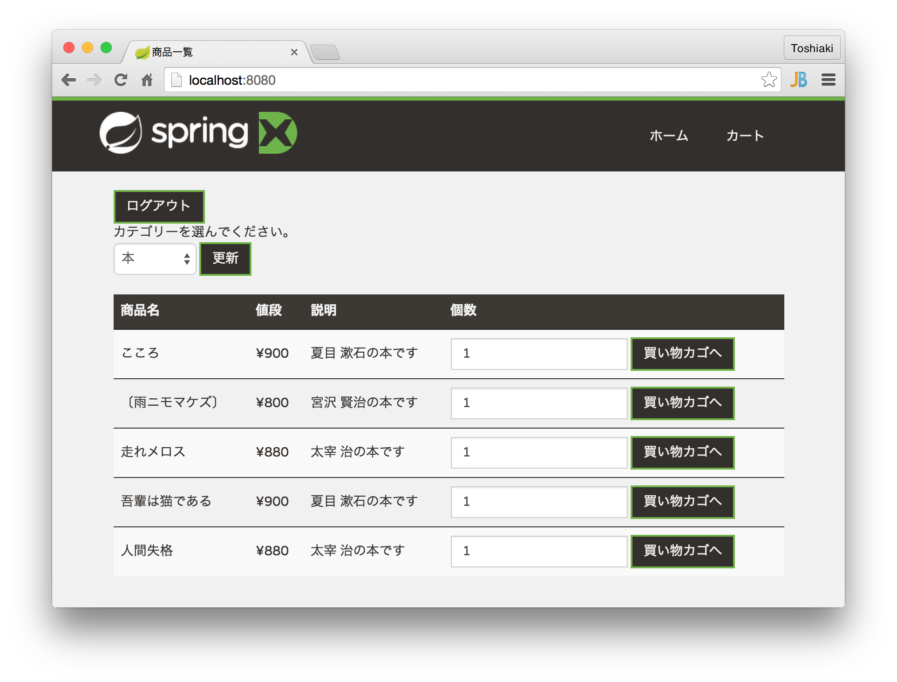
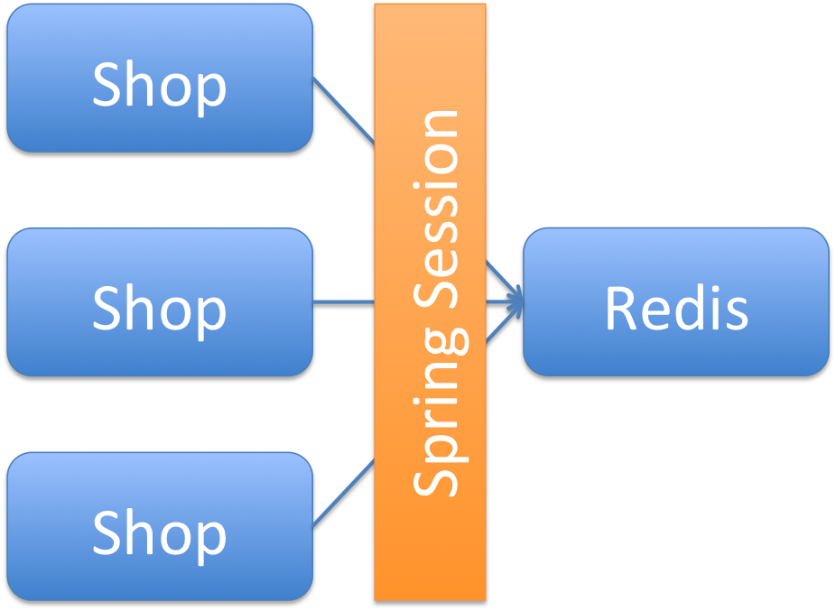

Spring Bootハンズオン
======================================================================================

本ハンズオンでは、簡単なECサイト作成を通じて、Spring Framework/Spring Bootの機能を学んでいきます。

また、RedisやSpring Sessionを用いてスケーラブルなWebアプリケーション作成方法を学びます。

ハンズオンを始める前に以下のソフトウェアをインストールしておいてください。

* Gitのインストール
* Java SE 8u45以上のインストール
* Maven 3のインストール
* IntelliJ IDEA(推奨) または Spring Tool Suite(Eclipse)のインストール
* IDEのLombokプラグイン(\ `IntelliJ IDE用 <https://github.com/mplushnikov/lombok-intellij-plugin>`__\ 0.9.4以上、または\ `Eclipse用 <https://projectlombok.org/download.html>`__\ 1.16.4以上)のインストール
* 【オプション】Redisのインストール (5章を実施する場合)
* 【オプション】Dockerのインストール (6章を実施する場合)

「\ `はじめてのSpring Boot <http://bit.ly/hajiboot>`__\ 」を読了しておくことを強くお勧めします。

目次:

.. toctree::
    :maxdepth: 2
    :numbered:

    GettingStarted
    ImplementControllers
    ExceptionHandling
    Caching
    SpringSession
    Docker

